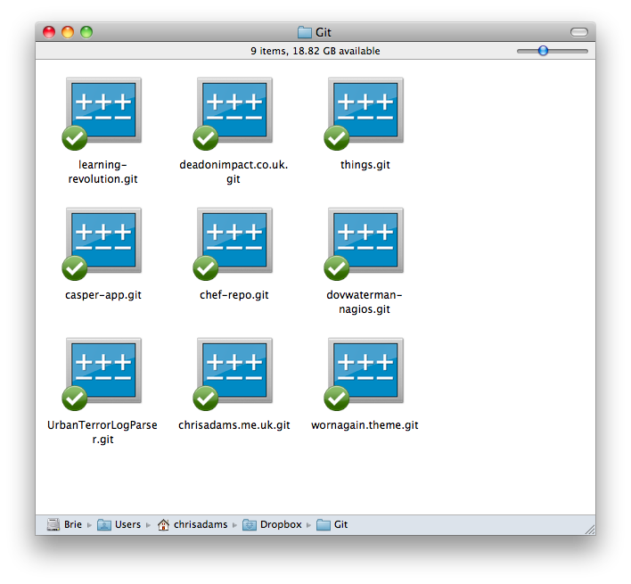

!SLIDE 

# Lets make our repo.

!SLIDE command

# git init

!SLIDE command

# .git

!SLIDE center

!SLIDE center

!SLIDE bullets incremental 

## What's in it?

* every snapshot of your code made so far, stored as commits
* specific preferences for this project 
* info about any branches, latest commits and other remote repos 

!SLIDE

# So long as you have the `.git` file, you can always regenerate a snapshot of any previous point on a project.

!SLIDE command

# cd brown-bag/
# git clone . ~/Backups/git-brown-bag.git

!SLIDE command 

# git clone 
# ~/Backups/git-brown-bag.git
# brown-bag-talk

!SLIDE command 
 
# git clone 
# git@code.headshift.com:drupal-project.git 
# php-spagetti-code

!SLIDE command 

# git clone 
# https://github.com/londonhackspace/Doorbot.git 
# doorbot

!SLIDE command 

# git clone 
# git://github.com/jquery/jquery-mobile.git 
# jq-mobile

