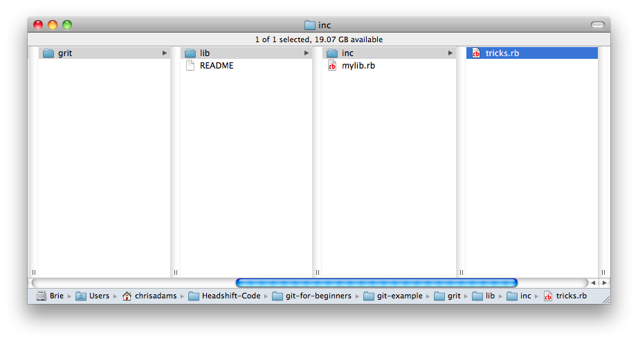
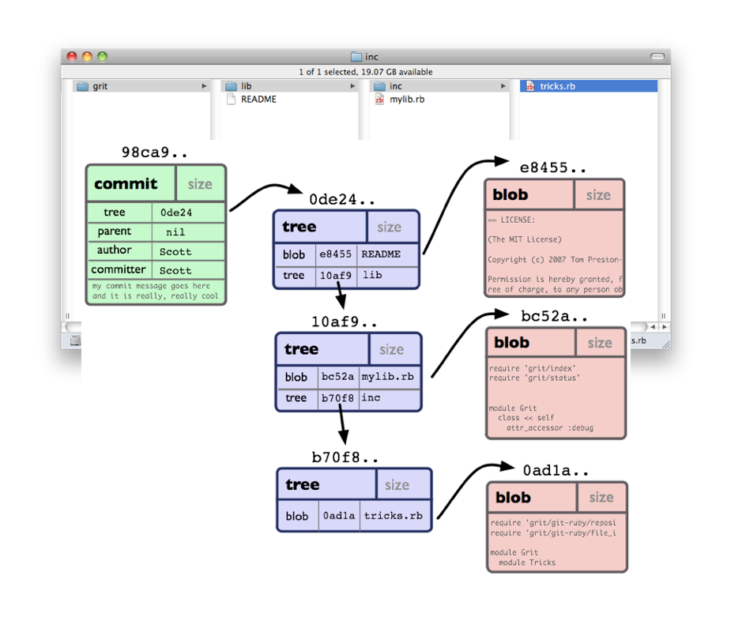

!SLIDE

# Committing.

!SLIDE bullets

# Important concepts:

* hashing
* walking the tree
* staging and the index

!SLIDE

###  Hashes are really handy.

!SLIDE center

# Data
  
!SLIDE

### (very clever crypto voodoo) 

!SLIDE 

# l0beec7b5ea3f0fdbc95d0dd47f3c5bc275da8a33

!SLIDE 

### Ambiguous 

## "give me file index.html"

!SLIDE

### Unambiguous

## "give me file :5b1d3b89ba449a9271b3c34d44b529d2a2633235"

!SLIDE bullets

* if contents changes, checksum changes
* super quick way for checking if a file has changed

!SLIDE 

## "give me blob 5b1d3b89ba449a9271b3c34d44b529d2a2633235"

!SLIDE center

## "give me blob 5b1d3b"

!SLIDE

# Wait.

!SLIDE

## How do we know what a file is called if we're just tracking contents?

!SLIDE center

## Hashes work for lists too. 
## This is how we link file contents (blobs) to file names.

!SLIDE center

!SLIDE center

# An example commit

!SLIDE  center

!SLIDE  center 

!SLIDE  center 

!SLIDE 

## Each commit contains the whole project tree.
## The contents of each file is verified with hashes.
## Every file of every version of your project up to now is already on your computer, inside `.git`

!SLIDE center

## A second look at the commit.

!SLIDE center

# Hashes let Git link any commit to any other commit, to create a history of changes.

