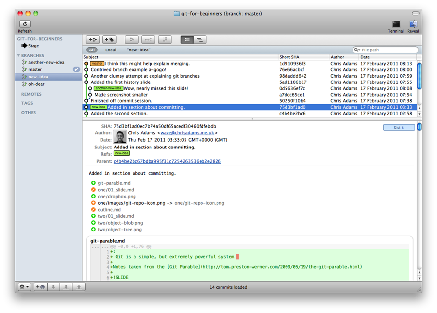

!SLIDE center

## A history of commits

!SLIDE center

### Any commit can link back to another parent commit.
### You can have multiple paths of of commits (branches)

!SLIDE center

### Simple branch example

!SLIDE center 

### Merging in another branch 

!SLIDE code

# git merge BRANCH_I_WANT_TO_MERGE_IN

!SLIDE code

# git merge another-new-idea
