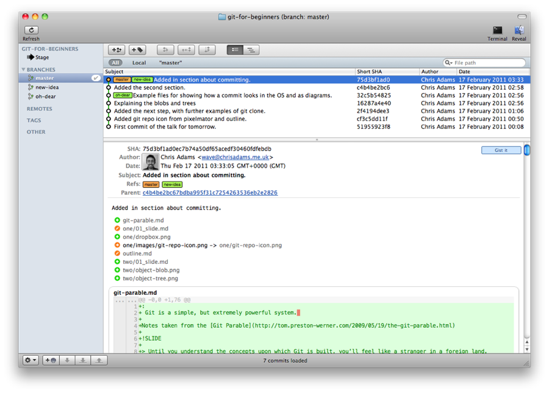
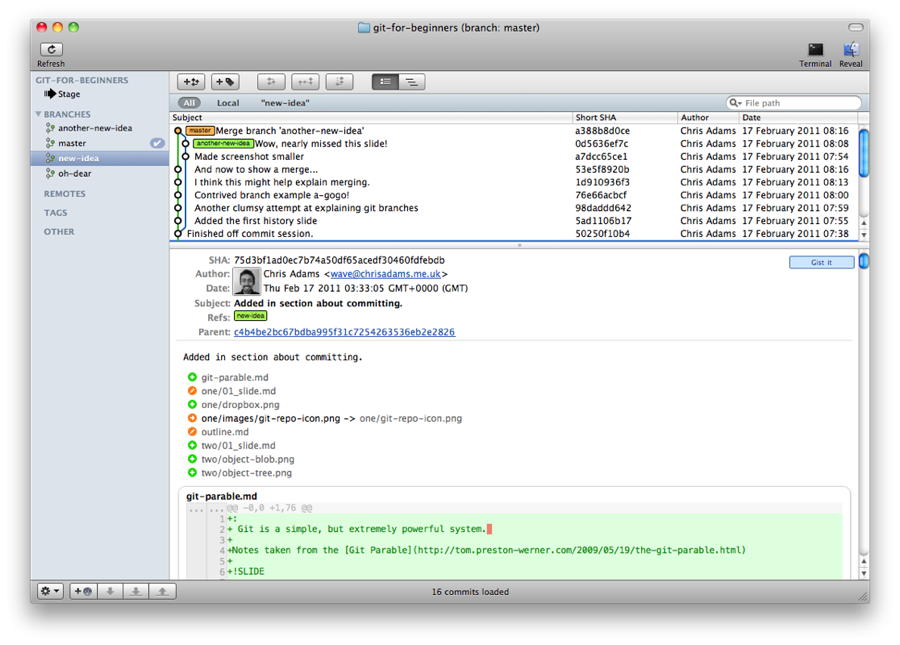

!SLIDE center

## A history of commits

!SLIDE center

!SLIDE center

### Any commit can link back to another parent commit.
### You can have multiple paths of of commits (branches)

!SLIDE center

### Two branches, to merge together.

!SLIDE center 

### Merging in another branch 

!SLIDE code

## git merge BRANCH_I_WANT_TO_MERGE_IN

!SLIDE code

## git merge another-new-idea

!SLIDE Merged branches center

