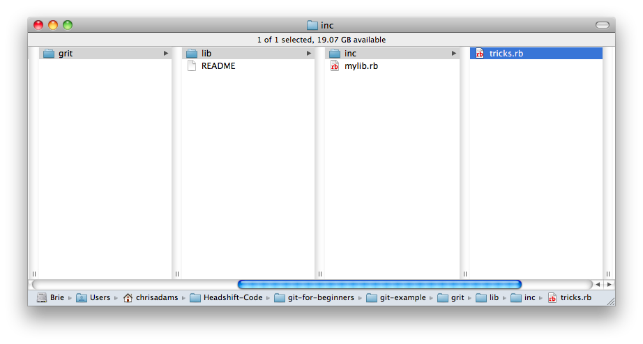
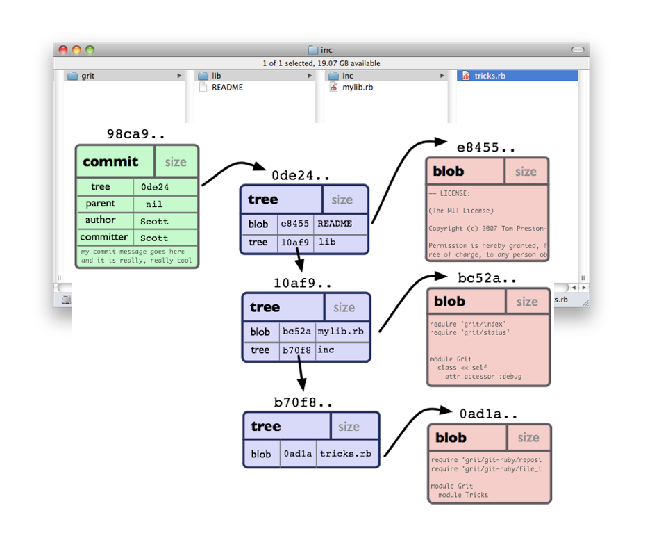

!SLIDE

# Committing.

!SLIDE bullets

# Important concepts:

* hashing
* walking the tree
* staging and the index

!SLIDE

###  Hashes are really handy.

!SLIDE center

# Data
  
!SLIDE

### (very clever crypto voodoo) 

!SLIDE 

# l0beec7b5ea3f0fdbc95d0dd47f3c5bc275da8a33

!SLIDE 

### Ambiguous 

## "give me file index.html"

!SLIDE

### Unambiguous

## "give me file :5b1d3b89ba449a9271b3c34d44b529d2a2633235"

!SLIDE bullets

* if contents changes, checksum changes
* super quick way for checking if a file has changed

!SLIDE 

## "give me blob 5b1d3b89ba449a9271b3c34d44b529d2a2633235"

!SLIDE center

## "give me blob 5b1d3b"

!SLIDE

# Wait.

!SLIDE

## How do we know what a file is called if we're just tracking contents?

!SLIDE center

## Hashes work for lists too. 
## This is how we link file contents (blobs) to file names.

!SLIDE center

!SLIDE center

# An example commit

!SLIDE  center

!SLIDE  center transition=slide

!SLIDE  center transition=slide

Each commit describes the whole project tree.
The contents of each file is verified by hash at each step.
Every file of every version up to now is already on your computer,
inside .git

!SLIDE

A second look at the commit.

!SLIDE

Hashes instead of numbers, allow for easier branching.

